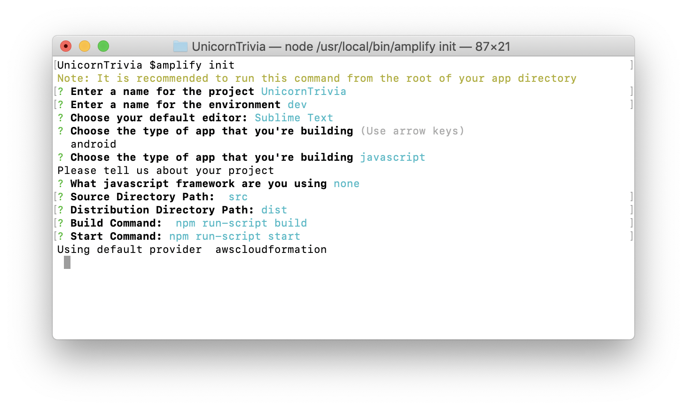
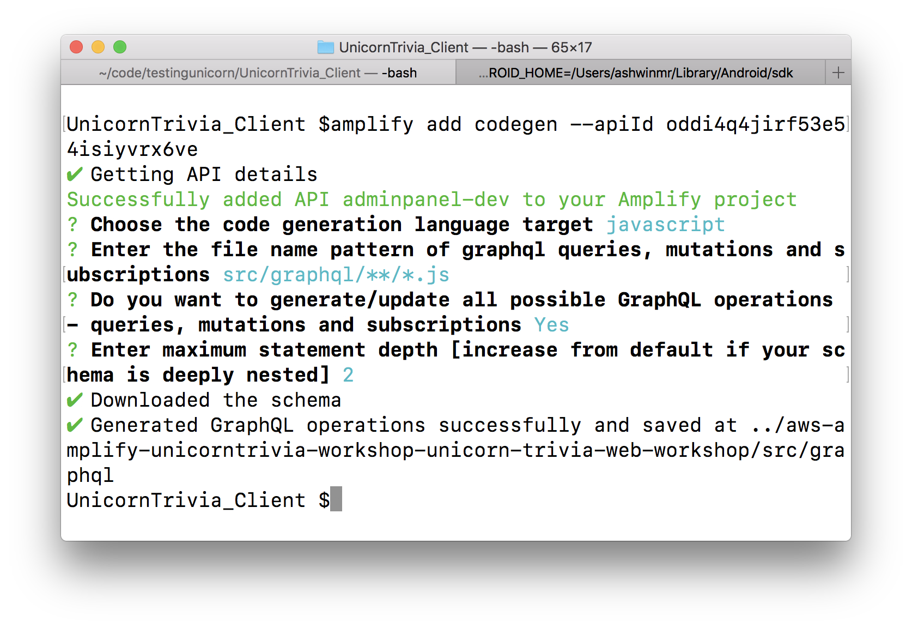
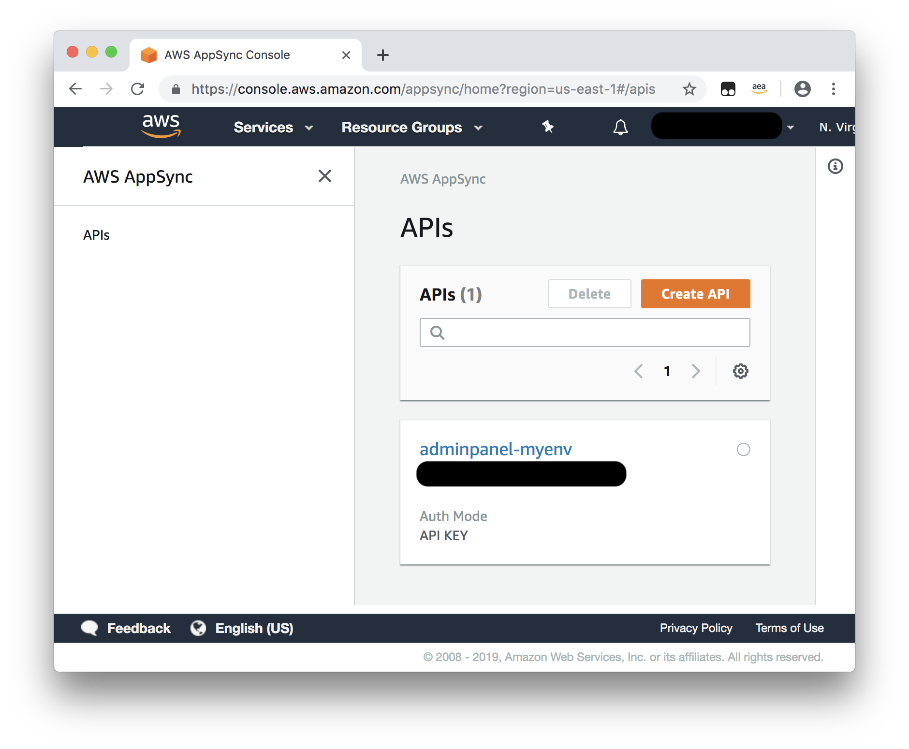
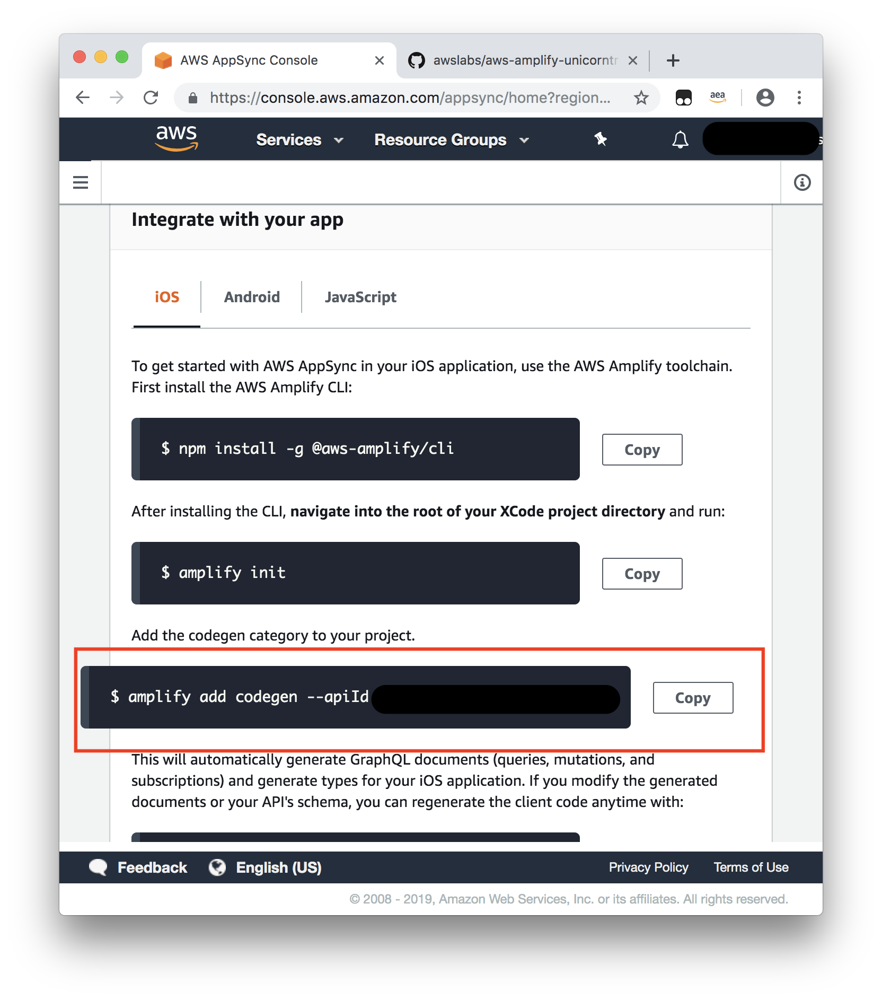

# Unicorn Trivia Workshop - Web Version

# Configuring your computer

Before we dive into building the React Web Client, please download a copy of this branch [here](https://github.com/awslabs/aws-amplify-unicorntrivia-workshop/archive/unicorn-trivia-web-workshop.zip)

Once you successfully download a copy and unzip its contents, open up a terminal in that folder to follow along with the instructions below.

# React Web Walkthrough

## Step 1: Preparing the project

1. Navigate to the client folder you downloaded earlier.
1. Run `npm install` from the terminal to install dependencies detailed in `package.json`

## Step 2: Updating the HLS Stream Source in the Video Component

Now that our environment is all set up, we are ready to begin implementing our application! React applications are made up of `Components`. Let's begin by creating the Video Player component that will display our video stream in the browser.

Navigate to `./src/components/Video/component.js`. The `component.js` file houses the code which defines how we display our livestream on the client device. Our goal for the Video Component is to update the `src` in the `constructor` function of the component. This `src` variable will point to the HLS stream you set up earlier and it will display the stream in your Video Player.

We will now connect the video player to our live streaming backend using the Mediastore egress URL generated in the previous step. 

Find the `constructor` and replace the value for the `src` key in `this.state` variable to your Mediastore egress URL. If you lost your MediaStore egress url from the amplify livestream setup, you can run `amplify livestream get-info` from the AdminPanel folder to get the MediaStore url. The url should be after the label `MediaStore Output Url:`

```javascript         
constructor(props) {
	super(props);
	this.state = {
		src: '#YOUR_MEDIASTORE_URL_HERE'
	};
}    
```

**REMEMBER TO REPLACE THE SOURCE URI WITH YOUR MEDIASTORE EGRESS URI**
If you experience performance issues or dropped frames in OBS (Remember there are 100+ other streamers in the room!), you can use paste this URL into the constructor instead of your own as a failback stream: https://jyxvhwgs4v47q5.data.mediastore.us-west-2.amazonaws.com/p/index.m3u8 

## Step 3: Subscribing to the GraphQL API backend
In this section we will be subscribing our client to the back end GraphQL API hosted in AWS AppSync.

1. Now you need to initialize our client as an Amplify project. Run `amplify init` in your client folder’s root directory and follow the prompts as shown below.
    

1. Next you will need to run `amplify add codegen --apiId <insert app id>`.  This will generate code for your app unique to the project. Follow the prompts below.
    

    1. If you forgot to save your apiID from the previous steps, you can always find it in the AWS AppSync console. To do so, navigate to the AppSync dashboard from within your AWS account and click on the name of the API you previously created.
        

    1. In the "Integrate with your app" section, you should see a command for how to add CodeGen to your existing project, copy and paste this command into the terminal.
        

 1. When Codegen finishes you should have a `API.swift` file and a `awsconfiguration.json` file in your directory.
    


1. Navigate to the following file and open it in a text editor `./src/components/Game/component.js`
1. Now we are ready to implement our graphql subscriptions. We will be creating two listeners, one listening for new questions and one listening for updated questions.
1. Find the function named `listenForQuestions` and paste in the following code.
	```javascript
	let self = this;
	API.graphql(
		graphqlOperation(onCreateQuestion)
	).subscribe({
		next: (data) => {
			self.setState({
				question: data.value.data,
				answerAvailable: false,
				questionAvailable: true,
				modalVisible: true,
				buttonsDisabled: false
			});
		}
	})
	```
This function creates a GraphQL subscription to the AppSync backend to listen for questions. Once the app recieves a question, it will store the question in the app and it will prompt the user to answer the question in the application.

1. Find the function named `listenForAnswers` and paste in the following code.
```javascript
let self = this;
API.graphql(
	graphqlOperation(onUpdateQuestion)
).subscribe({
	next: (data) => {
		setTimeout(() => {
			self.setState({
				answer: data.value.data,
				answerAvailable: true,
				questionAvailable: false,
				modalVisible: true
			});
		}, 1000);
	}
})
 ```
This function also creates a GraphQL subscription to the AppSync backend to listen for answers. Once the app recieves the answer to the question, it will store the answer in the app and it will prompt the user with the correct answer.

We are now successfully subscribed to our GraphQL backend and our application is listening for new questions and questions being answered!

## Step 4: Populating the question/answer modal

Now that our stream is playing and our subscriptions are set up. The last thing to do is to create the modal which displays the question and choices when a messaged, housing a new question or answer, is received by our listeners. Paste the following function code snippets into the `./src/components/Game/component.js` file.

1. The first step is to create the view for when a new question is pushed. Paste the following code into the `question` function.

	```javascript
	if(this.state.questionAvailable){
		setTimeout((() => {
			if(this.state.answerChosen == null){
				this.answerChosen(-1);
			}
			this.setState({
				modalVisible: false,
				questionAvailable: false,
				buttonsDisabled: true,
				selectedAnswerButton: null
			});
		}).bind(this), 10000);
		return(
			<div className="question-container">
				<div className="question">
					<div className="question-title-container">
						<div className="question-title">{ this.state.question.onCreateQuestion.question }</div>
					</div>
					<div className="answers-container">
						<div className="answers">
							{ this.answerButtons() }
						</div>	
					</div>
				</div>
			</div>
		);
	}
	```

1. We will then create a similar view. This time for when an answered question is returned to the user displaying the correct and incorrect answer choices. Implement this view by pasting in the following code into the `answer` function.

	```javascript
	let self = this;
	if(this.state.answerAvailable){
		setTimeout((()=> {
			let gameOver = this.state.questionCount == this.state.maxQuestions ? true : false;
			let wrongQuestions = this.state.answerChosen.answer !== this.state.answer.onUpdateQuestion.answers[this.state.answer.onUpdateQuestion.answerId] ? [...this.state.wrongQuestions, {question: this.state.answer, answer: this.state.answerChosen.answer}] : [...this.state.wrongQuestions];
			if(gameOver){
				setTimeout(() => {
					self.setState({
						modalVisible: true,
						modalBackground: "transparent"
					})
				}, 2000);
			}
			this.setState({
				modalVisible: false,
				answerAvailable: false,
				buttonsDisabled: false,
				wrongQuestions: wrongQuestions,
				answerChosen: {},
				selectedAnswerButton: null,
				gameOver: gameOver,
				winner: gameOver == true && wrongQuestions.length == 0 ? true : false,
				loser: gameOver == true && wrongQuestions.length > 0 ? true : false
			});
		}).bind(this), 10000);
		return(
			<div className="question-container">
				<div className="question">
					<div className="question-title-container">
						<div className="question-title">{ self.state.answer.onUpdateQuestion.question }</div>
					</div>
					<div className="answers-container">
						<div className="answers">
							{ self.answerButtons() }
						</div>	
					</div>
				</div>
			</div>
		);
	}
	```

1. The last function we need to include is the function that changes our data model when an answer is chosen. Lets call this function answerChosen. This function will also push answers to your AppSync backend. Paste this code into the `answerChosen` function.

	```javascript
	let answer = this.state.question.onCreateQuestion.answers[index];
	API.graphql(
		graphqlOperation(
			updateAnswer,
			{ input: {
				id: this.state.id,
				answer: [index]
			}}
		)
	).then((res) => {
		console.log("successfully submitted answer");
	}).catch((err) => {
		console.log("err: ", err);
	});
	this.setState({
		questionsAnswered: true,
		selectedAnswerButton: index,
		buttonsDisabled: true,
		answerChosen: {
			index: index,
			answer: answer
		},
		questionCount: this.state.questionCount + 1
	});
	```
**Well Done!** Now we have configured our application code to push and pull data from our GraphQL API. Let's move on to updating our AWS AppSync resolvers and mutations!

### Step Five: Recording answers

1. In the `./src/components/App/Game/component.js` file we need to now perfom a mutation to add an user to our database.
1. Add this code to the `setupClient` function.
	```javascript
	API.graphql(
		graphqlOperation(createAnswer, {input: {username: username}})
	).then(((res) => {
		this.setState({
			username: res.data.createAnswer.username,
			id: res.data.createAnswer.id
		});
	}).bind(this)).catch((err) => {
		console.log("err: ", err);
	});
	```
1. Add this code to the `askForName` function.
	```javascript	
	return(
		<div className="username-prompt-container">
			<div className="username-prompt">
				<div className="username-prompt-header-container">
					<div className="username-prompt-header">Please provide a username</div>
				</div>
				<div className="username-prompt-input-container">
					<input
						className="username-prompt-input"
						placeholder="Provide a username... then press enter"
						onKeyPress={((e) => {
							if(e.key === "Enter" && e.target.value != ""){
								this.setupClient(e.target.value);
							}
						}).bind(this)}
					/>
				</div>
			</div>
		</div>
	);
	```
This code is very similiar to what we did in our AdminPanel code. We just created a new User for our AnswersTable.


## Step 4: Update the backend
1. Open the [AppSync Console](https://console.aws.amazon.com/appsync/home) and navigate to your AppSync endpoint.
1. Once you select your AppSync endpoint on the left side select Schema.
    
1. You now should see your schema that was auto generated for you from Amplify. On the right side you should see a section called Resolvers. Search for `Mutation` in the text box and then select the clickable link next to `updateAnswer(...):Answer`
    
1. You are now presented with a Request Mapping Template and a Response Mapping Template.
    1. We are going to change the Request Mapping Templateto do the appending of the array.
    1. Navigate/search for `#set( $expression = "SET" )` and look for this line (should be near line 42):
        ```vtl
        #set( $expression = "$expression $entry.key = $entry.value" )
        ```
    1. Replace this line with:
        ```vtl
        #if ($util.matches($entry.key, "#answer"))
            #set( $expression = "$expression $entry.key = list_append(if_not_exists($entry.key, :empty_list), $entry.value)" )
            $util.qr($expValues.put(":empty_list", $util.dynamodb.toDynamoDB([])))
        #else
            #set( $expression = "$expression $entry.key = $entry.value" )
        #end
        ```
        This checks to see if the field being set is the answer array. If it is the array then it will append the value. We also do a check to see if the field exists and if it doesn't we create an empty array to append our first value to.
    1. Save the resolver in the top right corner.
1. Run the app again and now you should observe the answers are being correctly appended to the array.

## Step 5: Running the application!

Now that we have every section of the application implemented, it's time to run the app in our emulator.

1. From here run the command `npm start` to launch the application in the browser. The browser window should automatically open up. If not, navigate to `http://localhost:3000` to view the application.
1. From your AdminPanel, you can play along by posting a question, answering the question from the app, and then posting the answer to show you whether you got it correct.
1. If you closed the terminal window running the admin panel no problem! Just open a new terminal window and navigate to the AdminPanel folder and run `npm start`. Your default browser should now open up the admin panel on localhost:3000!

Now that you have finished implementing the basic app, if have extra time feel free to implement some extra features such as determining winners and customizing questions and answers. [Click here](https://github.com/awslabs/aws-amplify-unicorntrivia-workshop/blob/master/documentation/determine_the_winners.md) to move onward or else continue to the clean up section [here](https://github.com/awslabs/aws-amplify-unicorntrivia-workshop/blob/master/documentation/wrap_up_doc.md)!

## Troubleshooting Notes

1) Refresh your browser window manually or re-run `npm start`.
