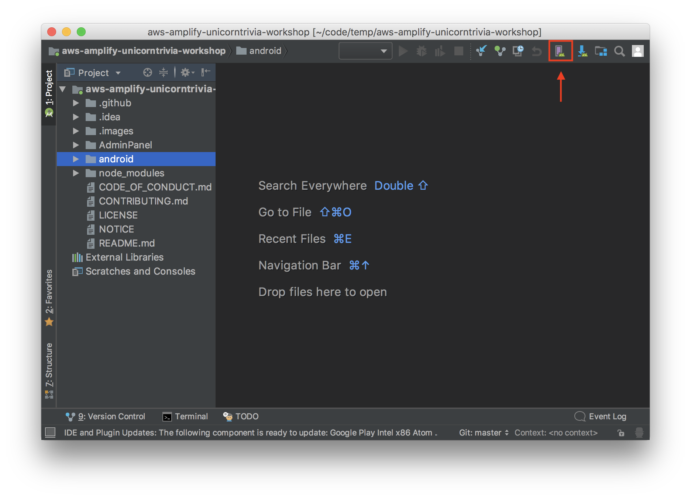
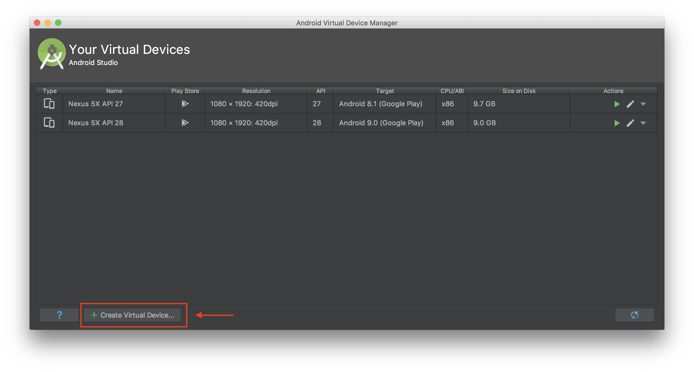
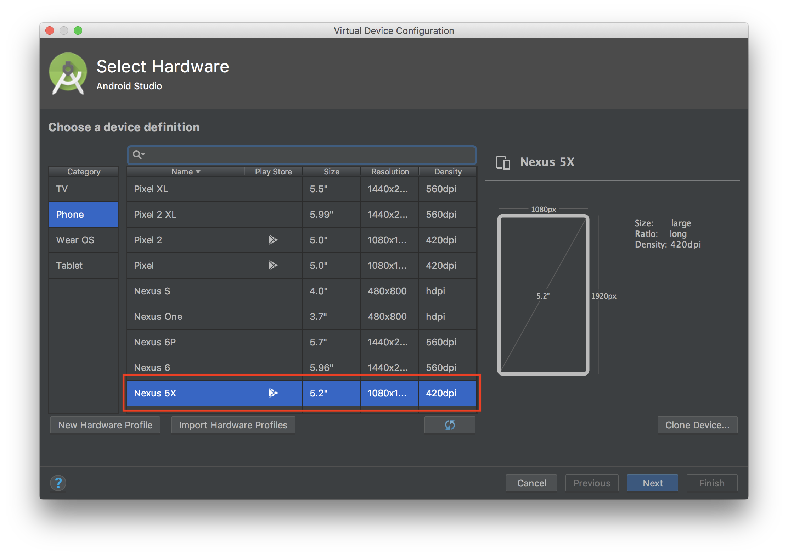
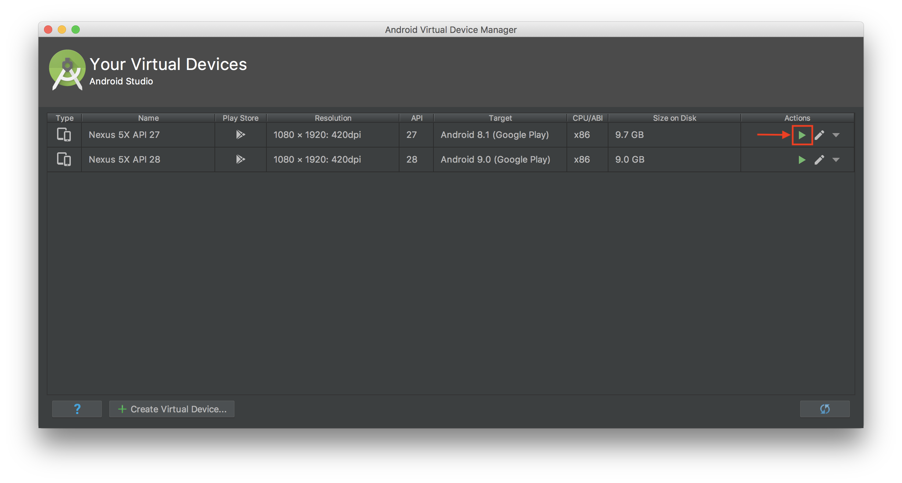

# Unicorn Trivia Workshop - React Native Version

# Configuring your computer

Before we dive into building the React Native Android Client, please download a copy of this branch [here](https://github.com/awslabs/aws-amplify-unicorntrivia-workshop/archive/unicorn-trivia-react-native-workshop.zip)

Once you successfully download a copy and unzip its contents, open up a terminal in that folder to follow along with the instructions below.

## Running React Native Android on Mac

* Install Node and Watchman using [Homebrew](http://brew.sh/)
* Install Intel x86 Atom_64 System Image from the Android Studio SDK menu

Install Node and Watchman using Homebrew using the below commands:

* `brew install node`
* `brew install watchman`

Install the react-native-cli with the node package manager(npm) using the following command:
* `npm install -g react-native-cli`

**Configure the ANDROID_HOME environment variable**
The React Native tools require some environment variables to be set up in order to build apps with native code.

Add the following lines to your $HOME/.bash_profile config file:
```
export ANDROID_HOME=$HOME/Library/Android/sdk
export PATH=$PATH:$ANDROID_HOME/emulator
export PATH=$PATH:$ANDROID_HOME/tools
export PATH=$PATH:$ANDROID_HOME/tools/bin
export PATH=$PATH:$ANDROID_HOME/platform-tools
```
The last step is to source the file. Run `source $HOME/.bash_profile`

You can make sure it worked by running `echo $PATH`!

## Running React Native Android on Windows

You will need Node, the React Native command line interface, Python2, a JDKm and Android Studio. While you can use any ditor of your choice to develop your app, you will need to install Android Studio in order to set up the necessary tooling to build your React Native app for Android.

**Node, Python2, JDK**

We recomment installing Node and Python2 via Chocolatey, a popular package manager for Windwos.

React Native also requires a recent version of the Java SE Development Kit (JDK), as well as Python 2. Both can be installed using [Chocolatey](https://chocolatey.org/).

Open an Administrator Command Prompt (right click command prompt and select "Run as Administrator"), then run the following command: `choco install  -y nodejs.install python2 jdk8`

**The React Native CLI**

Install the CLI using `npm install -g react-native-cli`

**Configure the ANDROID_HOME environment variable**
The React Native tools require some environment variables to be set up in order to build apps with native code.

Open the System pane under System and Security in the Windows Control Panel, then click on Change settings.... Open the Advanced tab and click on Environment Variables.... Click on New... to create a new ANDROID_HOME user variable that points to the path to your Android SDK:


The SDK is installed, by default, at the following location:`c:\Users\YOUR_USERNAME\AppData\Local\Android\Sdk`

You can find the actual location of the SDK in the Android Studio "Preferences" dialog, under Appearance & Behavior → System Settings → Android SDK.

Open a new Command Prompt window to ensure the new environment variable is loaded before proceeding to the next step.

# React Native on Android Walkthrough

## Step 1: Preparing the project
1. Run `export JAVA_HOME='/usr/libexec/java_home -v 1.8'` from your terminal to set the Java version needed to run the Android application.
	1. If you are on windows, make sure your Java version is "1.8.0_192"
1. Navigate to the root directory of the client folder you downloaded earlier.
1. Run`npm install` from the terminal to install dependencies detailed in `package.json`
1. Run `react-native link` from the terminal to link the React Native modules libraries to the project.

## Step 2: Building the Video Component

Now that our environment is all set up we are ready to begin implementing our application! React applications are made up of “Components". Let's begin by creating the Video Player component that will display our video stream on the Android simulator.

Navigate to `./src/components/Video/component.js`. The `component.js` file houses the code which defines how we display our livestream on the client device. Our goal for the Video Component is to update the `source` in the `ReactNativeVideoPlayer` component. This `uri` variable inside of the `source` prop will point to the HLS stream you set up earlier and it will display the stream in your Video Player.

We will now connect the video player to our live streaming backend using the Medistore egress URL generated in the previous step. 
1. Find the `constructor` and replace the value for the `uri` key inside of the `source` variable to your Mediastore egress URL. If you lost your MediaStore egress url from the amplify livestream setup, you can run `amplify livestream get-info` from the AdminPanel directory to get the MediaStore url. The url should be after the label `MediaStore Output Url:`.
	```javascript         
	return(
		<ReactNativeVideoPlayer
		    source={{uri: "#YOUR_MEDIA_STORE_URL_HERE"}}
		    ref={(ref) => {
			this.player = ref
		    }}
		    resizeMode={"stretch"}
		    muted={true}
		    style={{
			minWidth: Dimensions.get('window').width + 200,
			minHeight: Dimensions.get('window').height,
			left: -100
		    }}
		/>
	);	    
	```
**REMEMBER TO REPLACE THE SOURCE URI WITH YOUR MEDIASTORE EGRESS URI**

## Step 3: Subscribing to the GraphQL API backend
In this section we will be subscribing our client to the back end GraphQL API hosted in AWS AppSync.

1. Our first goal is to pull in some of the files generated by amplify during our AdminPanel set up into the client folder that you chose to build. We will do this by copying files from the AdminPanel folder you downloaded earlier into your client folder that you downloaded at the beginning of this client walkthrough. We will copy the `graphql` folder and `aws-exports.js` file from the AdminPanel directory in the AdminPanel folder into the client folder you are currently working out of.
	1. Look for the folder called `graphql` in the `./src` folder inside the AdminPanel directory. Copy that over to the `./src` folder inside your client folder.
	1. Look for the file `aws-exports.js` in the `./src` folder inside the AdminPanel directory. Copy that over to the `./src` folder inside your client folder.

We are now successfully subscribed to our GraphQL backend and our application is listening for new questions and questions being answered!

## Step 4: Update the backend
1. Open the [AppSync Console](https://console.aws.amazon.com/appsync/home) and navigate to your AppSync endpoint.
1. Once you select your AppSync endpoint on the left side select Schema.
    
1. You now should see your schema that was auto generated for you from Amplify. On the right side you should see a section called Resolvers. Search for `Mutation` in the text box and then select the clickable link next to `updateAnswer(...):Answer`
    
1. You are now presented with a Request Mapping Template and a Response Mapping Template.
    1. We are going to change the Request Mapping Templateto do the appending of the array.
    1. Navigate/search for `#set( $expression = "SET" )` and look for this line (should be near line 42):
        ```vtl
        #set( $expression = "$expression $entry.key = $entry.value" )
        ```
    1. Replace this line with:
        ```vtl
        #if ($util.matches($entry.key, "#answer"))
            #set( $expression = "$expression $entry.key = list_append(if_not_exists($entry.key, :empty_list), $entry.value)" )
            $util.qr($expValues.put(":empty_list", $util.dynamodb.toDynamoDB([])))
        #else
            #set( $expression = "$expression $entry.key = $entry.value" )
        #end
        ```
        This checks to see if the field being set is the answer array. If it is the array then it will append the value. We also do a check to see if the field exists and if it doesn't we create an empty array to append our first value to.
    1. Save the resolver in the top right corner.
1. Run the app again and now you should observe the answers are being correctly appended to the array.

## Step 5: Running the application!

Now that we have every section of the application implemented, it's time to run the app in our emulator.

1. First we want to open up the root path of our project in Android Studio.
1. The next step is to create and launch an Android emulator. We will start by clicking the purple phone icon in the menu bar.

1. Next we will chose the create virtual device button

1. We need to choose a device compatible with older versions of the API. Lets choose a Nexus 5X device! Then select Next.

1. Finally we need the android API Level 27 system image. This should be Android Oreo. If you don't already have it installed go ahead and begin the download (remember to check your drive for available space as these downloads can be fairly large)
1. Now select next and finish to return back to the previous screen. You should see your newely created virtual device. From here choose the green 'Play' button to launch the emulator!

1. Wait for android to launch and the home screen to appear. Then return to the terminal and navigate back to the root directory of our application.
1. From here run the command `react-native run-android` to launch the application in the emulator

**Congratulations!** You have now successfully implemented a UnicornTrivia application on one of three suported platforms! 
Now Try sending some questions and answers using the admin panel we configured previously.

If you closed the terminal window running the admin panel no problem! Just open a new terminal window and navigate to the admin panel root directory and run `npm start`. Your default browser should now open up the admin panel on localhost:3000!

Now you have finished, feel free to skip on forward to the clean up section [here](https://github.com/awslabs/aws-amplify-unicorntrivia-workshop#wrap-up)!

## Troubleshooting Notes

1) if android sdk isnt installing. click file → invalidate cache and restart
