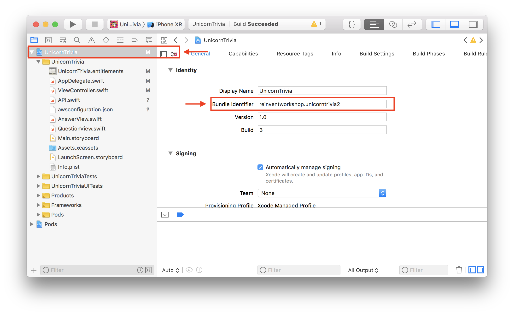
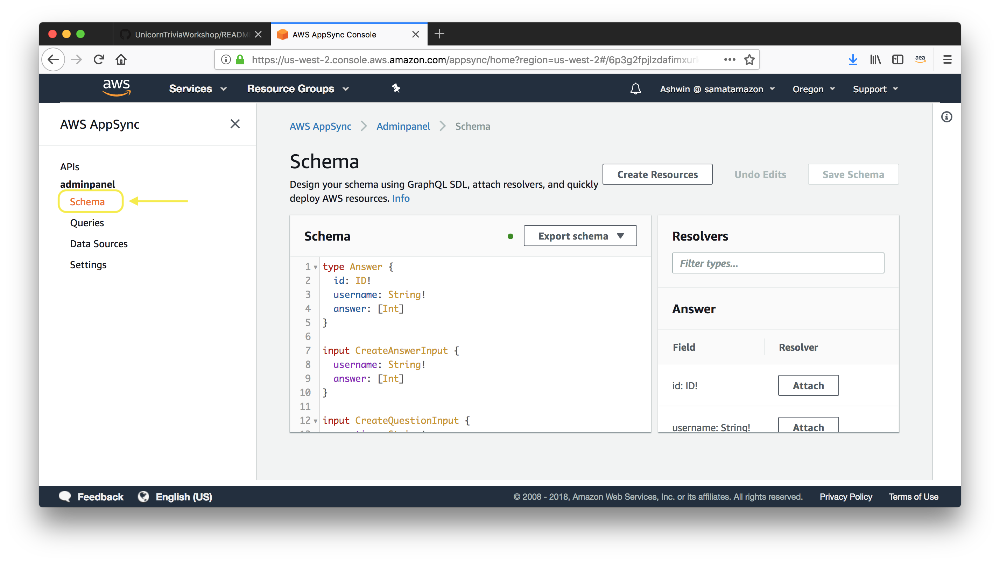

# Unicorn Trivia Workshop - iOS Version

### Configuring your computer.
Before doing this workshop please install these required programs

1. Download and install Xcode from the [AppStore](http://appstore.com/mac/apple/xcode)
1. Install Pods using this command `sudo gem install cocoapods`, if you have pods installed then run `pods update`
1. Download this zip file [here](https://github.com/awslabs/aws-amplify-unicorntrivia-workshop/archive/unicorn-trivia-ios-workshop.zip)

## iOS Walkthrough

### Step One: Configuring your Xcode Enviroment
1. Open the UnicornTrivia.xcworkspace
1. Navigate to the root of the project and change the bundle identifier to `yourname.unicorntriva` and make sure that the Team section is set to None. Should look something like this:
    
1. Copy your `GraphQL endpoint` & `GraphQL api key` from your `AdminPanel` setup that you created in our last section and place it in the UnicornTrivia/awsconfiguration.json

### Step Two: Displaying your HLS Stream
1. If you lost your egress url from the `amplify livestream` setup then you can run `amplify livestream get-info` again to get the MediaStore url. It should look something like this: `url`
1. Navigate to UnicornTrivia/ViewController.swift in Xcode. Then insert the url where you find the text `INSERT_URL_HERE`

## Step Three: Update the backend
1. Open the [AppSync Console](https://console.aws.amazon.com/appsync/home) and navigate to your AppSync endpoint.
1. Once you select your AppSync endpoint on the left side select Schema.
    
1. You now should see your schema that was auto generated for you from Amplify. On the right side you should see a section called Resolvers. Search for `Mutation` in the text box and then select the clickable link next to `updateAnswer(...):Answer`
    
1. You are now presented with a Request Mapping Template and a Response Mapping Template.
    1. We are going to change the Request Mapping Templateto do the appending of the array.
    1. Navigate/search for `#set( $expression = "SET" )` and look for this line (should be near line 42):
        ```vtl
        #set( $expression = "$expression $entry.key = $entry.value" )
        ```
    1. Replace this line with:
        ```vtl
        #if ($util.matches($entry.key, "#answer"))
            #set( $expression = "$expression $entry.key = list_append(if_not_exists($entry.key, :empty_list), $entry.value)" )
            $util.qr($expValues.put(":empty_list", $util.dynamodb.toDynamoDB([])))
        #else
            #set( $expression = "$expression $entry.key = $entry.value" )
        #end
        ```
        This checks to see if the field being set is the answer array. If it is the array then it will append the value. We also do a check to see if the field exists and if it doesn't we create an empty array to append our first value to.
    1. Save the resolver in the top right corner.
1. Run the app again and now you should observe the answers are being correctly appended to the array.
