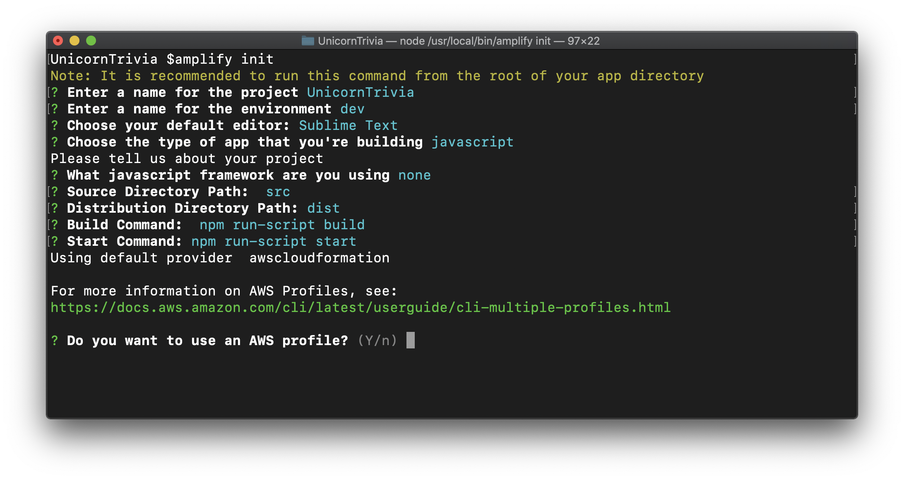
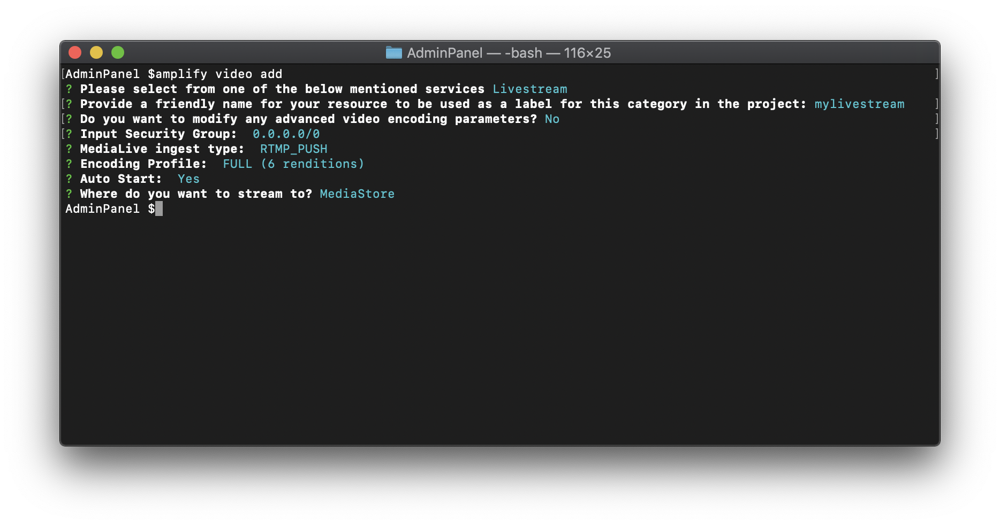
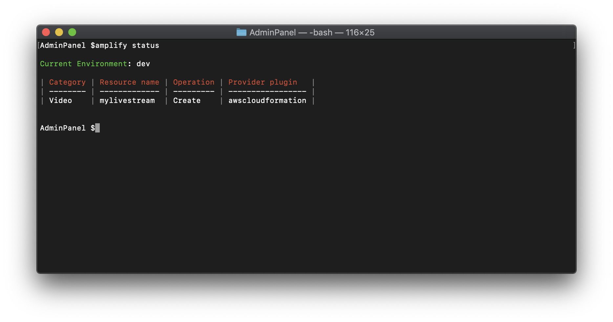
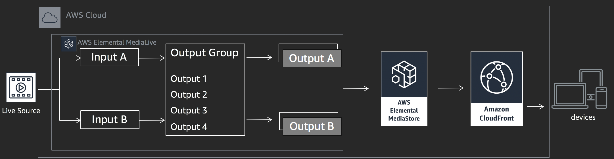
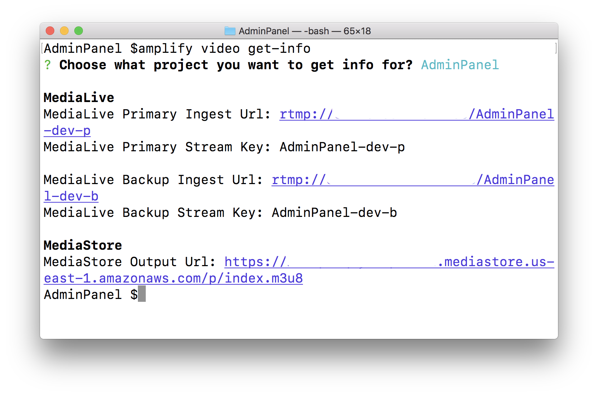
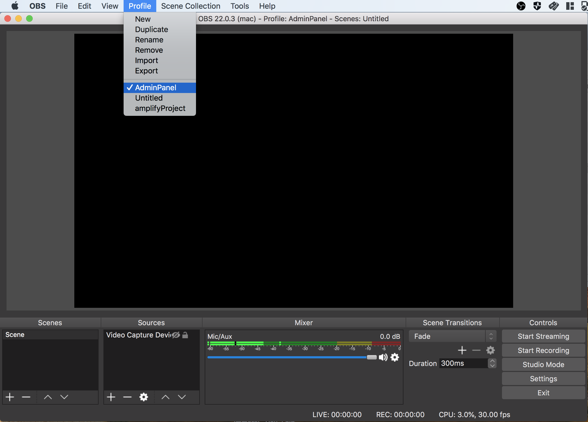
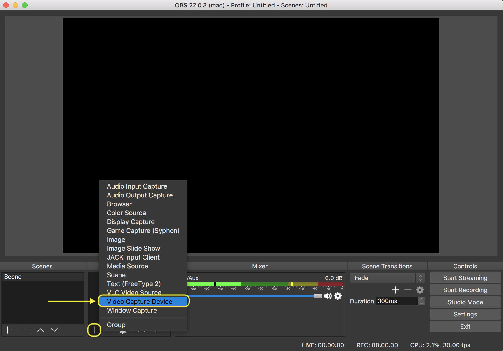
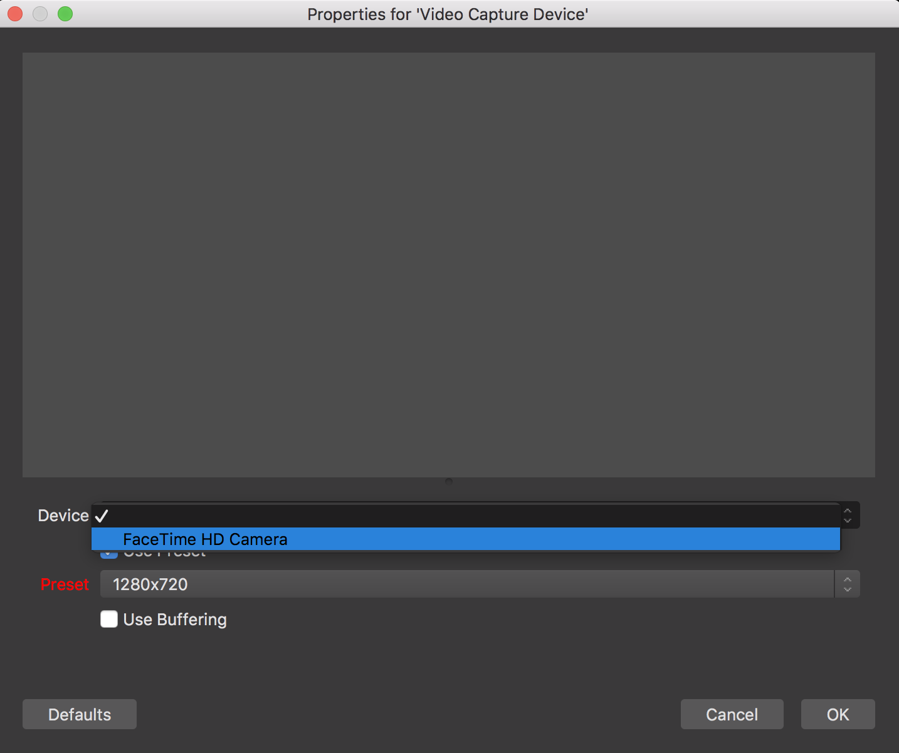
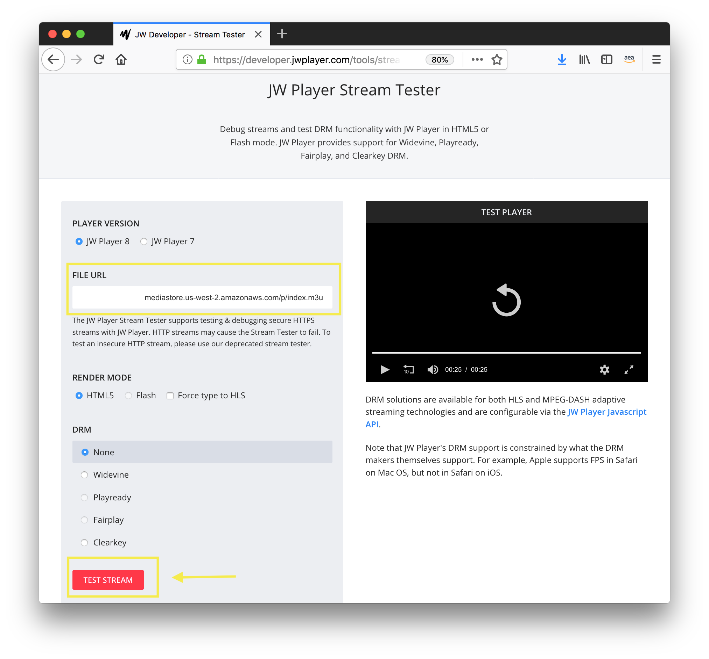

## Live Streaming Service

We'll start by building a live streaming service that can receive a source signal from a studio, transcode the source into Adaptive BitRate (ABR), and serve the content to our application. ABR streaming protocols like Apple HTTP Live Streaming (HLS) and MPEG Dynamic Adaptive Streaming over HTTP (DASH) allow clients to access the live stream over any network connection and provide the best viewing experience to users.

To encode a stream into ABR you need a real-time video encoder. There are many open-source and commercial options for real-time encoding, but many of them would require you to manage the deployment, scaling, and failover - _you're not interested in any of this_ - that's where AWS Elemental MediaLive comes in. MediaLive is a fully-managed AWS service that can process live media and create ABR protocols like HLS and DASH. MediaLive *does not* act as an origin to serve the streaming video, for that, we'll need another service.

For video files, S3 Static Hosting is a popular way to host video. In a live streaming scenario, however, it's not recommended to use S3 as a live streaming origin due to the way many ABR protocols work and the [S3 Data Consistency Model](https://docs.aws.amazon.com/AmazonS3/latest/dev/Introduction.html#overview). What other options do we have? AWS Elemental released two other services to help us with content origination - MediaPackage and MediaStore. The application is interactive, so we want to keep the latency from the studio to our end users under 10 seconds. You read a [comprehensive blog post](https://aws.amazon.com/blogs/media/how-to-compete-with-broadcast-latency-using-current-adaptive-bitrate-technologies-part-1/) from AWS on streaming latency and decided that for our use case, MediaStore is the best fit.

Now you need to deploy MediaLive and MediaStore. Sure, you could use the AWS Console or even AWS CloudFormation, but you're an app developer in a hurry and not interested in writing YAML or JSON. You plan to use AWS Amplify CLI/SDK for the mobile app, maybe there's a way to manage your live streaming infrastructure with the same tools? Luckily, you met an Solutions Architect at the AWS SFO Summit who shared with you a [AWS Amplify plugin](https://aws-amplify.github.io/docs/cli/plugins) that does just this very thing. Let's get building!

1. First, open a terminal and navigate to the AdminPanel directory inside the unzipped project files.
**Please make sure the left hand side says AdminPanel. If it does not please use `cd AdminPanel`. If it doesn't say AdminPanel please raise your hand!**
1. Run `amplify init`. This command creates new AWS backend resources (in this case a single S3 bucket to host your cloudformation templates) and pull the AWS service configurations into the app!
1. Follow the prompts as shown in the below Image. Remember, even if you are implementing the ios or android version of the application, you **MUST** choose javascript here since the admin panel is a web app that makes calls to the graphql backend and is seperate from the client. 
    1. If you do not have the AWS CLI installed and configured, amplify will direct you to create a default profile. 
    1. Note that because of the services leveraged, your AWS profile **MUST USE** us-west-2, us-east-1, eu-west-1, eu-central-1, ap-northeast-1, or ap-southeast-2.
    
1. Now, add the amplify video module to the project using `amplify video add`
1. Again, follow the prompts as shown in the image below
      
1. Once the prompts complete, make sure the module was added by checking `amplify status`
    
1. Now it is time to create our resources! Now run `amplify push` to create the backend resources for the video component! It will take a few minutes to stage and create the resources in your AWS environment. While that runs, let's take a brief look at what was just created! The Amplify CLI plugin created a MediaLive Channel which will process and deliver video segments to a MediaStore container (also created by the plugin). We'll serve the stream from MediaStore, but note that it is recommended to use a Content Delivery Network (CDN) like Amazon CloudFront. To begin processing video, you now need to send a source to the MediaLive endpoint.

1. In order to retrieve the MediaLive endpoint that you just created, run the command `amplify video get-info`.
1. Note down the  **MediaStore HLS Output Url** as you will need it later for your client.
    
1. If you haven't already done so, please install OBS at this time by refering to the "Configuring your computer" section for the download link.
1. To setup OBS to start streaming to your newly created endpoint you can run the command `amplify video setup-obs`. This command will setup a OBS profile which is preconfigured. 
1. Now Launch OBS and navigate to the profile menu and select your Project Name. This will switch your settings to a preconfigured profile ready to stream to the livestream. If you don't see your profile listed, try closing the OBS application and re-opening it and check the profile tab again.

1. The last step is adding an audio and video source. Under Sources on the bottom left hand side, select the **+** icon to add a source.
1. Choose Video Capture Device. Click the "Create New" radio button and provide a unique name and select ok.

1. In the next screen choose your video capturing device(most likely your laptop's built in web cam). Again, select ok.

1. Finally we need to add an audio source. Again choose the **+** icon in the sources pane. This time choose "Audio Input Capture".
1. Again, make sure the "Create New" radio button is selected and supply a name for the source and select ok. Under device, choose "Built in Microphone" and hit ok.
1. We are now ready to start the stream! Hit the "Start Streaming" button under the "Controls" panel in the bottom right hand side.
1. Check that the stream is up by pasting the MediaStore HLS Output Url into Safari or any supported HLS player. You can use the [JW Player Stream Tester](https://developer.jwplayer.com/tools/stream-tester/) if you don't have an HLS compatible player installed. Just paste your MediaStore output URL into the File URL Field on the page and click the red "Test Stream" Button. You should now see your channel playing in the Test Player.
    

Congratulations! You have now hosting a Live Stream on AWS! Now let's setup the Administrator Panel that we will use to send trivia questions and collect answers from users watching our live stream. [Click Here](https://github.com/awslabs/aws-amplify-unicorntrivia-workshop/blob/master/documentation/admin_panel_doc.md)! to continue to the next step!
