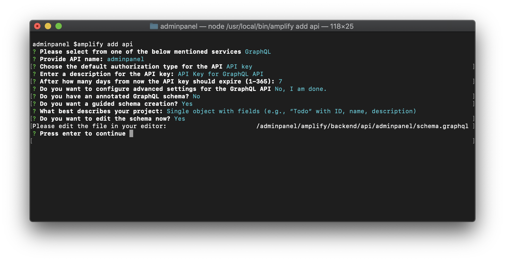
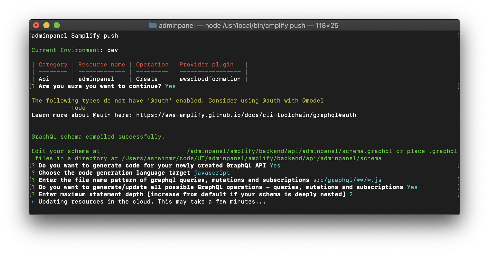

## Administrator Panel

Our next step is to build an Administrator Panel which can be used to fire off API calls. This panel will be used by the host of the game to push questions and answers to the clients. In previous meetings, the UnicornTrivia dev team has settled on GraphQL to implement the api backend. Due to time to market being a critical business driver, we have decided on using a managed GraphQL service and due to its tight integration with AWS services, [AWS AppSync](https://aws.amazon.com/appsync/) will be the managed service of choice to serve our back end requests.

We will also be using the [AWS Amplify](https://aws-amplify.github.io/) library to effortlessly configure backends. We will be using the templating engine within [AWS Amplify](https://aws-amplify.github.io/) called CodeGen to quickly template the structure of our api and our live streaming infrastructure without hand writing any code! 

1. Open a terminal and navigate to the AdminPanel directory.
1. Once you are in the AdminPanel directory install the dependencies using `npm install` for the adminpanel 
1. Now to start the local deployment of the AdminPanel run the command `npm start`
    1. A tab should now automatically open in your default browser to `http://localhost:3000/`. You have now successfully deployed the administrator panel for UnicornTrivia!
    1. When you issue the command `npm start` from the root directory of a React project, NodeJS will look for a scripts object in your package.json file. If found, it will look for a script with the key start and run the command specified as its value. You can view which scripts will be run by taking a look into package.json and taking a look at the "scripts" object.
1. Now that you have the AdminPanel installed and running now it it is time to add in your API. Just like before when we setup the live stream you can use Amplify to setup the backend for the AdminPanel. Run `amplify api add` and use these values
    
    1. This will open your default editor with a default GraphQL model:
        ```graphql
        type Todo @model {
           id: ID!
           name: String!
           description: String
        }
        ```
    1. Change the model to:
       ```graphql
       type Question @model {
           id: ID!
           question: String!
           answers: [String]!
           answerId: Int
       }

       type Answer @model {
           id: ID!
           username: String!
           answer: [Int]
       }
       ```
    1. Save the file you just edited using your text editor.
1. Now run `amplify push` to create the backend resources.
    
        The models you defined above create the following on the backend:
        
        Each one of these models will have a DynamoDB table associated with it and each will be connected to AppSync through Resolvers. Resolvers are how AWS AppSync translates GraphQL requests and fetches information from your AWS resources (in this case the DynamoDB table). Resolvers can also transform the information sent to and received from your AWS resources. We will dive deeper in a later section on this.
1. Time to add the ablity to push questions. Open the src/App.js file in your favorite text editor.
1. Add this code this code to the top of the file:
    ```javascript
     import {createQuestion, updateQuestion} from './graphql/mutations.js';
     import {onCreateQuestion} from './graphql/subscriptions.js';
     import aws_exports from './aws-exports';
    ```
1. Under all the imports add the following line of code. This statement retrieves the configuration information from the aws-exports.js file and it will be updated as you update your resources using Amplify.
    ```javascript 
    Amplify.configure(aws_exports);
    ```
1. Add this code to LOCATION1, this creates a question from the table data in the format of input:
    ```javascript
    const question = {
        input: {
          question: rowData["Question"],
          answers: rowData["Answers"]
        }
      }
    API.graphql(graphqlOperation(createQuestion, question)).then(response => {
          rowData["id"] = response.data.createQuestion.id;
          console.log(response.data.createQuestion);
        });
    ```
1. Add this code to LOCATION2:
    ```javascript
    const question = {
          input: {
            id: rowData["id"],
            answerId: rowData["Answer"]
          }
        }
    API.graphql(graphqlOperation(updateQuestion, question)).then(response => {
          console.log(response.data.updateQuestion)
        });
    ```
1. Run `npm start` and observe we are now pushing questions by opening the javascript debug console in your browser and clicking Post Question or Post Answer which is how we'll send trivia to our end-users.

Now that we have configured our back end, and can collect and tally answers from our trivia participants, let's move on to configuring the front end in the client. [Click here](https://github.com/awslabs/aws-amplify-unicorntrivia-workshop/blob/master/documentation/client_doc.md) and then select one of the three client options to continue!


