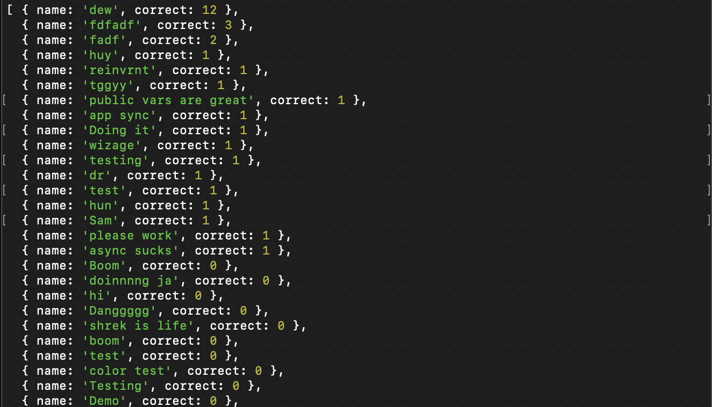

## Determine the Winner(s)

Now that you have a live stream, an admin panel to push questions, and clients to submit their answer, the last step is to determine who has won. Navigate to the leaderboard inside primary workshop admin panel directory: `/aws-amplify-unicorntrivia-workshop/AdminPanel/leaderboard`

Next, open `index.js` and add the Dyanamo answer table name. Access this via the console if you haven't already during the Appsync resolver configuration. It should look something like: `Answers-SOMERANDOMTEXT`

Open a terminal window, and cd into the leaderboard directory.

Then run `npm install`

Run `npm start` and see the winner(s) listed at the top!

**Congrats!** if you still have extra time, [Click Here](https://github.com/awslabs/aws-amplify-unicorntrivia-workshop/blob/master/documentation/customizing_questions_doc.md) to continue onwards to learn about how to customize questions you can send to the client or [Click Here](https://github.com/awslabs/aws-amplify-unicorntrivia-workshop/blob/master/documentation/wrap_up_doc.md) to return to the Wrap Up Section. 
