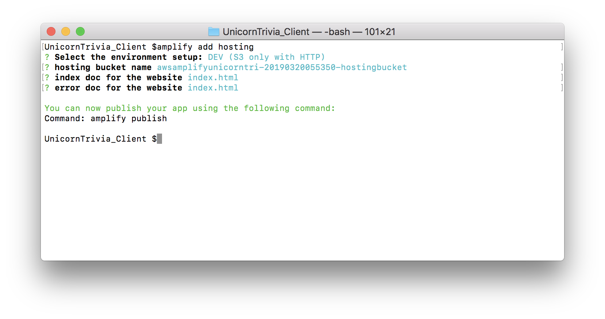
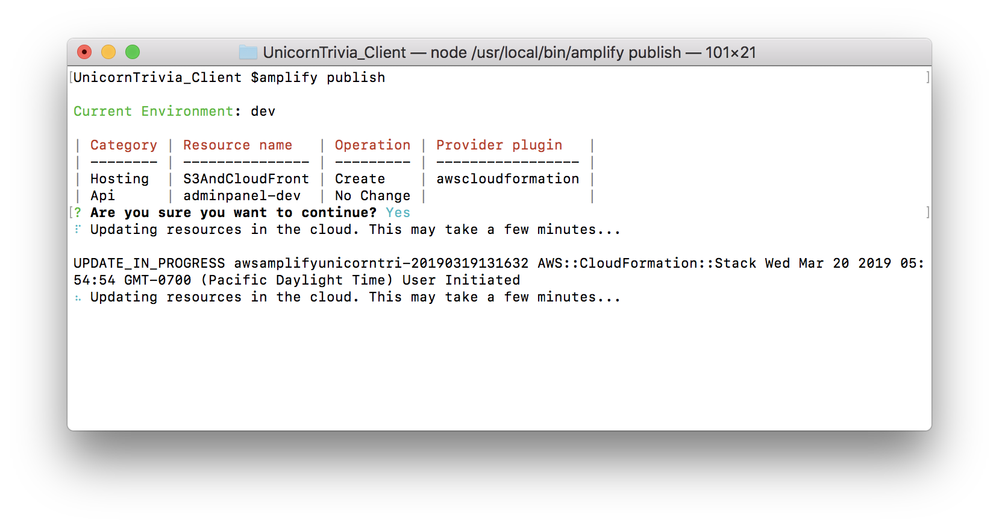

## Publish your app

Now that you have a local running copy of Unicorn Trivia on your computer, it is time to host your first game. To do this you will need to publish your compiled app onto to S3 and send the url to your friends. To do this on your web project you can simply get started by setting up hosting using amplify.

1. In your web client project run `amplify add hosting`

2. After you have configure amplify to add hosting, you can now run `amplify publish` to compile and push your code to the cloud.

3. After publish finishes you should have a url you can visit on any device you would like.

**Congrats!** if you still have extra time, [Click Here](https://github.com/awslabs/aws-amplify-unicorntrivia-workshop/blob/master/documentation/customizing_questions_doc.md) to continue onwards to learn about how to customize questions you can send to the client or [Click Here](https://github.com/awslabs/aws-amplify-unicorntrivia-workshop/blob/master/documentation/wrap_up_doc.md) to return to the Wrap Up Section.
