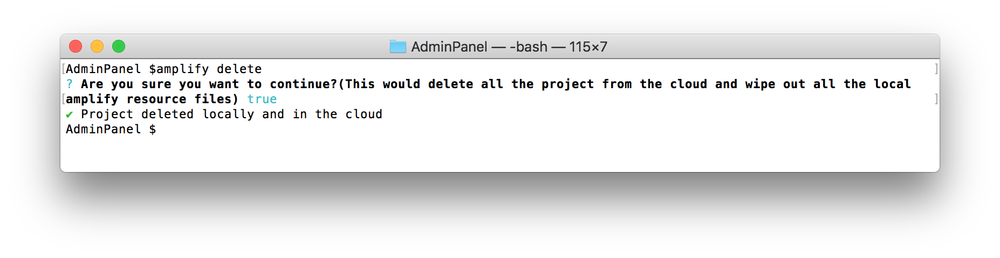

## Wrap Up

It's absolutely critical to remove the backend resources when you have completed the workshop to avoid ongoing charges. To remove the backend and local resources managed by Amplify CLI, run the following command in the AdminPanel directory: `amplify delete`

Once the command completes, check the process to ensure it has completed successfully. Navigate to your default region in the AWS Console and confirm that there are no MediaLive channels running or configured. You can also validate that there are no remaining stacks in AWS CloudFormation.

You have now completed the UnicornTrivia workshop. If you enjoyed building this project, [tweet about it](https://ctt.ac/a33ay) or star this github repo to show your support!
